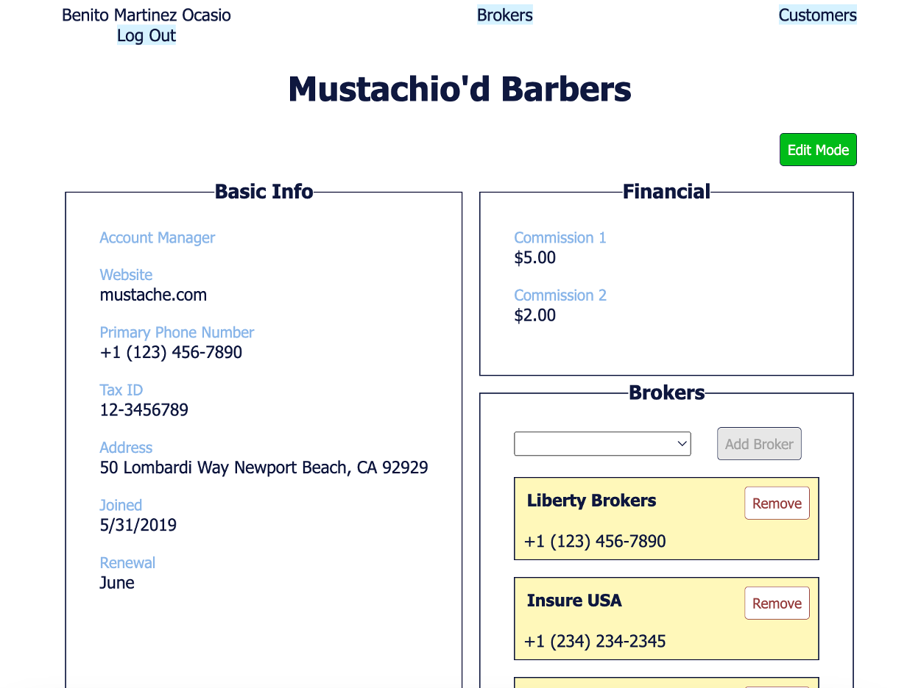
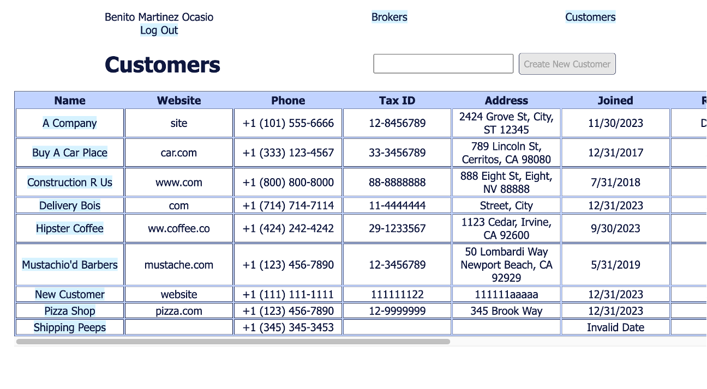

# Business Tracker Demo Site
This site is a demo to help prospective users picture how they would like a similar site custom created for their business. The site serves as one big graphic interface for a company's data so everyone can use the database without special training.

In this demo, the data models are based on my experience with health insurance third-party administrator companies. These companies work together with insurance brokers and employers to administer employee benefits. The benefit plans can be highly complex, and they change constantly. So do many other important details such as contact information for the clients and their brokers. When one thing changes, a cascade of other changes need to happen in response.

This site fills three needs: It serves as a database for frequently referenced information, it automatically performs the necessary updates to related fields when one field is updated manually, and it creates tasks and alerts to remind users of the related actions that need to be taken elsewhere.

Here, the data models and automated actions are much simpler than they would be in a real workplace. For actual use, the site would be fully built out with all the details specific to the company using it. 

# Screenshots

# Technologies Used

- Javascript
- React
- Node
- Express
- MongoDB
- Mongoose
- JSX
- CSS
- Tailwind

# Getting Started

[Click to demo](https://sample-business-tracker-ve-b731cbb53a18.herokuapp.com/)

# Next Steps

- Add plan type B and reorganize the plans section
- Set up a tasks dashboard with tasks created when certain fields of certain models change
- Integrate Google Maps API to select addresses